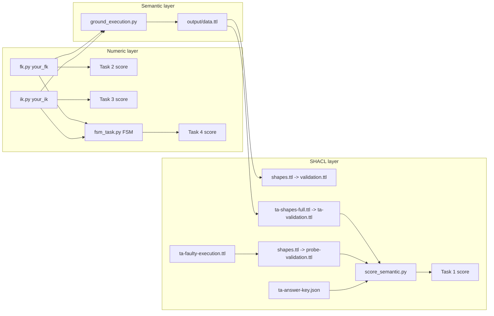

# HW3 TA Internal Guide

**UR5 Kinematics, FSM Manipulation, and Semantic Knowledge Graphs**
NYCU Physical AI / TAICA — Homework 3

> **TA INTERNAL — DO NOT DISTRIBUTE TO STUDENTS.**
> This document contains reference-solution locations, hidden-test procedures, grading internals, and answer-key details. The student-facing counterpart is `hw3_template/STUDENT_GUIDE.md`.

Document map:

| Document                             | Audience                        | Location                     |
| ------------------------------------ | ------------------------------- | ---------------------------- |
| `STUDENT_GUIDE.md`                 | Students                        | `hw3_template/` (released) |
| `TA_INTERNAL_GUIDE.md` (this file) | TAs / instructors               | `hw3_demo/` (internal)     |

---

## 1. Background and Assignment Overview

### 1.1 Background and motivation

Robot manipulation rests on two mathematical primitives — forward kinematics (FK) and inverse kinematics (IK) — but students who implement them only against unit tests never see how they behave inside a real control loop, and never see how execution *data* becomes machine-interpretable *knowledge*. This assignment closes both gaps, and deliberately puts the knowledge layer FIRST:

1. Students *ground* an FK/IK execution process (produced by TA reference solvers — no student kinematics needed) as structured RDF that reuses standard robotics ontologies, and write SHACL shapes that detect problem states (arm out of range, non-convergence, joint-limit violation) directly from the grounded numbers. They therefore know the checked data classes, forms, and expected results before implementing any algorithm.
2. Students implement FK and IK for a simulated UR5 arm from scratch (no simulator kinematics APIs allowed) — re-running the Task 1 pipeline with `--own` at any time for immediate semantic feedback on their own solvers.
3. A TA-provided deterministic finite state machine (FSM) drives pick-and-place episodes using the student's own solvers, cross-checking FK against physics at every state transition.

### 1.2 Assignment objectives

- Convert execution-process data into a semantic knowledge graph following the REUSE principle (reuse standard vocabularies rather than inventing ad-hoc ones).
- Author SHACL constraints whose validation results on a TA-provided dataset must match a published answer key exactly — built BEFORE any algorithm, so implementation work gets immediate semantic feedback.
- Implement classic Denavit–Hartenberg (D-H) forward kinematics and a 6×6 geometric Jacobian for a 6-DoF arm.
- Implement an iterative Jacobian-based IK solver (damped least squares recommended).
- Observe both solvers operating inside a complete manipulation pipeline.

### 1.3 Learning objectives

After completing the assignment, a student can:

1. Model robot specifications and executions as structured RDF using CORA, SOMA, IEEE 1872 POS, and QUDT, with typed `xsd:double` literals instead of strings (Task 1).
2. Write SHACL node shapes with correct target classes, paths, inclusive thresholds, and message conventions — including a SHACL-SPARQL constraint for comparisons SHACL Core cannot express — and interpret SHACL validation reports (Task 1).
3. Derive and compose classic D-H homogeneous transforms into an end-effector pose (Task 2).
4. Construct a geometric Jacobian (`linear = z(i-1) × (p_end − p(i-1))`, `angular = z(i-1)`) (Task 2).
5. Explain and tune damped-least-squares IK (damping, step rate, iteration budget, stopping threshold, joint-limit clipping) (Task 3).
6. Explain why an FSM pipeline localizes kinematic failures to a specific state and check type (Task 4).

### 1.4 Problem statement

First (Task 1) ground a reference FK/IK execution process into `data.ttl` reusing standard ontologies, and write three SHACL shapes (two value-range shapes and one SHACL-SPARQL joint-limit shape) such that validating a TA-provided 30-record execution dataset reproduces the TA answer key exactly — no FK/IK implementation is needed; the data comes from the TA reference solvers. Students therefore know the checked data classes, forms, and thresholds BEFORE implementing any algorithm. Then (Tasks 2–4) implement `your_fk` and `your_ik`, pass visible and hidden accuracy tests, achieve 10/10 seeded FSM pick-and-place episodes — re-running the Task 1 pipeline with `--own` at any point for immediate semantic feedback on their own execution.

### 1.5 Scope

**In scope:** RDF/Turtle authoring via provided serializers, SHACL node shapes with value-range constraints and one SHACL-SPARQL constraint (cross-node joint-limit comparison), analytic FK, geometric Jacobian, iterative IK, and reading/executing a provided FSM.
**Out of scope:** motion planning, collision avoidance, learned policies, OWL reasoning, SPARQL querying, dynamics/force control.

### 1.6 High-level workflow and expected final outcome

```
Task 1  bash semantic/run_task1.sh --group <id>
                              -> 30/30 (S1 12 + S2 8 + S3 10; TA reference solvers,
                                 no FK/IK needed — the semantic layer is built FIRST)
Task 2  python fk.py          -> 20/20 (FK 10 + Jacobian 10, zero error counts)
Task 3  python ik.py          -> 40/40 (mean error ~1e-3 m)
Task 4  python fsm_task.py    -> 10/10 (10/10 SUCCESS episodes, deterministic)
(during/after Tasks 2-3: re-run Task 1 with --own — the semantic layer gives
 immediate feedback on the student's own solvers)
Total                            100/100
```

### 1.7 Technical concepts a TA must understand

- **Classic D-H convention** (not modified D-H): transform order `Rz(θ)·Tz(d)·Tx(a)·Rx(α)`. The table in `get_ur5_DH_params()` matches this repository's `ur5.urdf` and intentionally differs from the official UR5 datasheet — always answer student questions from the in-repo table.
- **Geometric Jacobian** built from preceding-frame axes; grading compares against ground-truth matrices with an L2-norm threshold.
- **Damped least squares**: `Δq = Jᵀ(JJᵀ + λ²I)⁻¹ Δx`, scaled by a step rate, warm-started from the current joint state.
- **REUSE grounding**: robots are `cora:Robot`; joints `soma:RevoluteJoint`; joint states `soma:JointState` with `soma:hasJointPosition`; poses `soma:6DPose` composed of an IEEE 1872 `pos:Position` component and a quaternion component; units are QUDT IRIs (`unit:M`, `unit:RAD`). The ontology file declares these as offline stubs; no network resolution is needed. The `hw3:` namespace mints only what no standard covers (computations, D-H parameters, statuses, distances).
- **SHACL closed-world validation**: numeric thresholds live in SHACL (`sh:maxInclusive`), never in OWL. The Jena `shacl` CLI produces Turtle validation reports; the scorer parses `sh:focusNode` / `sh:resultMessage` pairs (note: Jena emits `rdf:type sh:ValidationResult`, not the `a` shorthand).

---

## 2. System Requirements

| Component                 | Requirement                                                                                                                                                      | Status              |
| ------------------------- | ---------------------------------------------------------------------------------------------------------------------------------------------------------------- | ------------------- |
| Operating system          | Linux; Ubuntu 20.04+ is what the assignment is verified on. macOS/Windows are untested for release (Instructor Confirmation Required before advertising support) | Required            |
| CPU                       | Any x86_64 CPU able to run PyBullet real-time physics; no specific model required                                                                                | Required            |
| GPU                       | **Not used.** No CUDA, no cuDNN, no deep-learning framework                                                                                                | Not applicable      |
| RAM                       | No formal minimum measured; the pipeline runs comfortably on typical lab machines (TBD if a formal figure is needed)                                             | —                  |
| Storage                   | < 1 GB total (repo + conda env + ~30 MB Jena cache)                                                                                                              | Required            |
| Python                    | 3.7, in a dedicated conda environment                                                                                                                            | Required            |
| Python packages           | `pybullet`, `numpy`, `scipy` (no version pins; verified with the builds pip resolves for Python 3.7)                                                       | Required            |
| Java                      | JDK 11+ (only for Task 1's Jena `shacl` CLI)                                                                                                                   | Required            |
| Apache Jena               | 4.10.0, auto-downloaded and cached by `run_task1.sh`                                                                                                           | Required (auto)     |
| Docker                    | Not used                                                                                                                                                         | Not applicable      |
| Conda (Miniconda)         | Environment manager                                                                                                                                              | Recommended         |
| VS Code or similar editor | —                                                                                                                                                               | Optional            |
| Network                   | Needed once: pip installs + one ~30 MB Jena download; fully offline afterwards                                                                                   | Required (one-time) |
| X display                 | Only for the optional `-g` GUI modes (`DISPLAY` must be set; lab machines use `:1`)                                                                        | Optional            |

---

## 3. Complete Installation Guide

### 3.1 Environment preparation

```bash
# Miniconda (skip if already installed)
wget https://repo.anaconda.com/miniconda/Miniconda3-latest-Linux-x86_64.sh
bash Miniconda3-latest-Linux-x86_64.sh
source ~/.bashrc
conda --version

# Git (usually preinstalled on Ubuntu)
sudo apt-get -y install git

# Optional editor: VS Code or any editor of choice
```

### 3.2 Repository setup

```bash
git clone <REPO_URL>        # TBD — Instructor Confirmation Required (course repo URL)
cd <repo>/hw3_template      # the released student tree; TAs also use hw3_demo/
```

No submodules and no special branches are required. The relevant trees:

| Tree                        | Content                                                                    |
| --------------------------- | -------------------------------------------------------------------------- |
| `hw3_template/`           | Released student version (STUDENT TODO stubs; provenance flag `--group`) |
| `hw3_demo/`               | Fully solved TA verification copy (provenance flag `--student-id`)       |
| `hw3_demo/solutions/` | Drop-in reference solutions (see §7) — never distribute                  |

### 3.3 Dependency installation

```bash
conda create --name taica-hw3 python=3.7 -y
conda activate taica-hw3
pip install pybullet numpy scipy

sudo apt-get -y install openjdk-11-jdk
```

No CUDA-related dependencies exist. The simulation stack (`pybullet_robot_envs`, `pybullet_planning`, `hw3_utils`) is vendored inside the assignment tree; nothing else is installed.

### 3.4 Dataset and resource setup

There is **no dataset, model, or checkpoint download**. All assets ship in the tree:

| Asset              | Path                                                                                                      | Purpose                          |
| ------------------ | --------------------------------------------------------------------------------------------------------- | -------------------------------- |
| Ontology           | `semantic/ontology/hw3-ontology.ttl`                                                                    | Task 1 REUSE vocabulary (offline stubs; documented in §4.4) |
| TA dataset         | `semantic/ta-faulty-execution.ttl` (30 records)                                                         | Task 1 S3 input                  |
| Answer key         | `semantic/ta-answer-key.json`                                                                           | Task 1 S3 expected flags         |
| TA SHACL suite     | `semantic/ta-shapes-full.ttl`                                                                           | Task 1 S1/S2 grading shapes      |
| Apache Jena        | `semantic/.cache/apache-jena-4.10.0/` (auto-downloaded)                                                 | Task 1 `shacl` CLI               |
| Visible test cases | `test_case/{fk,ik}_test_case_{easy,medium,hard}.json`                                                   | Task 2/3 self-checks (FK part also feeds Task 1 grounding) |
| Hidden test cases  | `test_case/{fk,ik}_test_case_{ta1,ta2}.json` — **kept off the release; TA adds at grading time** | Task 2/3 grading                 |

Environment variables (all optional): `PYTHON` (interpreter used by `run_task1.sh`), `JENA_HOME` (pre-extracted Jena, skips download), `GROUND_SCRIPT` (TA-only grounding override, §7), `DISPLAY` (GUI modes).

### 3.5 Environment verification

| Check                         | Command                                                    | Expected                              |
| ----------------------------- | ---------------------------------------------------------- | ------------------------------------- |
| Python env                    | `python --version`                                       | `Python 3.7.x`                      |
| Packages                      | `python -c "import pybullet, numpy, scipy; print('OK')"` | `OK` (plus a PyBullet build banner) |
| GPU/CUDA                      | —                                                         | Not applicable                        |
| Java                          | `java -version`                                          | version 11+                           |
| Test cases                    | `ls test_case/`                                          | six `*_easy/medium/hard.json` files |
| Semantic assets               | `ls semantic/ta-*.ttl semantic/ta-answer-key.json`       | three files listed                    |
| Jena (after first Task 4 run) | `ls semantic/.cache/`                                    | `apache-jena-4.10.0`                |

### 3.6 End-to-end verification (TA)

From `hw3_demo/` (already solved) or a template copy with the reference solutions applied (§7):

```bash
conda activate taica-hw3        # or prefix commands with PYTHON=... as below
bash semantic/run_task1.sh --student-id ta    # (template tree uses --group)
# expected final lines:
#   [S3] TA dataset vs answer key: faulty 14/14, clean 16/16 OK  (+10)
#   Your Task 1 Score : 30.0 / 30.0
bash semantic/run_task1.sh --student-id ta --own   # same 30/30 via the solved your_fk/your_ik
python fk.py                    # expected: Your Total Score : 20.000 / 20.000
python ik.py                    # expected: Your Total Score : 40.000 / 40.000
python fsm_task.py              # expected: 10 × SUCCESS, Your Total Score : 10.000 / 10.000
```

`run_task1.sh` exits 0 only when the Task 1 score is ≥ 29.9, so `echo $?` is a one-line health check. On the course lab machine the existing environment is named `pdm-hw3`; prefix commands with `PYTHON=~/miniconda3/envs/pdm-hw3/bin/python` instead of activating `taica-hw3`.

---

## 4. Assignment Structure and Architecture

### 4.1 Directory structure (released tree)

```
hw3_template/
├── fk.py                      # Task 2 — students implement your_fk()
├── ik.py                      # Task 3 — students implement your_ik()
├── fsm_task.py                # Task 4 — TA-provided FSM (protected)
├── test_case/                 # visible test cases (protected)
├── hw3_utils/                 # drawing/motion helpers (protected)
├── pybullet_planning/         # vendored planning utilities (protected)
├── pybullet_robot_envs/       # vendored UR5 env + suction gripper (protected)
├── docs/hw3-student-guide.html
├── STUDENT_GUIDE.md / README.md
└── semantic/
    ├── ground_execution.py    # Task 1 — students implement 2 functions
    ├── shapes.ttl             # Task 1 — students implement 3 shapes
    ├── common.py              # serializers + sim helpers (protected)
    ├── diagnose.py            # Tasks 2-4 -> Task 1 bridge (protected)
    ├── ontology/hw3-ontology.ttl        (protected)
    ├── ta-faulty-execution.ttl          (protected)
    ├── ta-answer-key.json               (protected)
    ├── ta-shapes-full.ttl               (protected)
    ├── score_semantic.py                (protected)
    ├── run_task1.sh                     (protected)
    └── output/                # generated: data.ttl + three validation reports
```

**Students modify exactly four files:** `fk.py`, `ik.py`, `semantic/ground_execution.py`, `semantic/shapes.ttl`. Everything else is protected; at grading time only those four files are taken from the submission (§6.5).

### 4.2 Key interfaces

| Symbol                                                                                        | File                    | Contract                                                                                                                   |
| --------------------------------------------------------------------------------------------- | ----------------------- | -------------------------------------------------------------------------------------------------------------------------- |
| `robot_spec_to_triples(dh_params, joint_limits)`                                            | `ground_execution.py` | Task 1 TODO 1 — robot spec → Turtle lines                                                                                |
| `ik_computation_to_triples(target_uri, joint_config, ik_status, residual, target_distance)` | `ground_execution.py` | Task 1 TODO 2 — one IK execution → Turtle lines                                                                          |
| `pose_to_ttl` / `joint_config_to_ttl`                                                     | `semantic/common.py`  | Task 1 structured-node serializers students should call                                                                    |
| `diagnose(task_label, fk_records, ik_records)` | `semantic/diagnose.py` | Tasks 2–4 → Task 1 bridge: grounds execution records with the STUDENT's Task 1 functions, validates with the student's `shapes.ttl`, prints per-record flags. Fail-soft (skips if Task 1 unfinished or Jena missing); runs AFTER scoring, never affects scores |
| `get_ur5_DH_params()`                                                                       | `fk.py`               | Returns the classic D-H table (authoritative)                                                                              |
| `your_fk(DH_params, q, base_pos)`                                                           | `fk.py`               | Task 2 — returns `(pose_7d, jacobian)`; the trailing `adjustment` block aligns to the simulator EE frame and must not be edited |
| `your_ik(robot_id, new_pose, base_pos, max_iters=1000, stop_thresh=0.001)`                  | `ik.py`               | Task 3 — returns 6 joint angles; grading passes **default arguments only**                                               |
| `FSMPipeline.move_to(state, position)`                                                      | `fsm_task.py`         | Task 4 — one motion = IK solve → position control → IK check (≤ 3 cm) → FK check (≤ 1 cm); up to 3 warm-started re-solves |

### 4.3 Data and execution flow



`run_task1.sh` steps: (1) toolchain check → (2) Jena download/cache → (3) grounding (TA reference solvers by default; `--own` uses the student solvers) → (4) three `shacl validate` runs → (5) scoring.

**Tasks 2–4 → Task 1 feedback loop:** `fk.py`, `ik.py`, and `fsm_task.py` each collect execution records (failing cases plus one clean sample) and, after printing the score, call `semantic/diagnose.py` — which REUSES the student's `robot_spec_to_triples` / `fk_computation_to_triples` / `ik_computation_to_triples` to write `output/diagnosis-data.ttl`, validates it with the student's `shapes.ttl`, and prints per-record problem flags (`output/diagnosis-validation.ttl` holds the full report). This is why Task 1 comes first: the same vocabulary and thresholds check every later run. Fail-soft by design: unfinished Task 1 TODOs or a missing Jena produce a one-line skip notice and never change a score.

### 4.4 Ontology definition reference (`semantic/ontology/hw3-ontology.ttl`)

The single authority for the Task 1 vocabulary. Design rule (stated in the file's `owl:Ontology` header): **REUSE existing standard vocabularies wherever a suitable term exists; mint `hw3:` terms only for course-specific concepts no standard covers.** External terms are declared as **minimal local stubs with their ORIGINAL IRIs** (official CORA/SOMA/DUL files are not guaranteed to resolve on grading machines) — `hw3:` never redefines them.

**Namespaces**

| Prefix | IRI | Role |
| --- | --- | --- |
| `hw3:` | `http://taica.course/hw3/ontology#` | Course-minted classes/properties + fixed target instances (`hw3:target_near/mid/far`) |
| `stu:` | (data namespace, declared in `data.ttl`) | Student-produced instances (robot, joints, computations) |
| `probe:` | `http://taica.course/hw3/data/probe#` | TA dataset instances in `ta-faulty-execution.ttl` |
| `cora:` | `http://purl.org/ieee1872-owl/cora-bare#` | IEEE 1872 CORA — robots |
| `soma:` | `http://www.ease-crc.org/ont/SOMA.owl#` | SOMA — joints, joint states, 6D poses |
| `pos:` | `http://purl.org/ieee1872-owl/pos#` | IEEE 1872 POS — position/orientation/pose |
| `dul:` | `http://www.ontologydesignpatterns.org/ont/dul/DUL.owl#` | DOLCE+DnS Ultralite — upper-level alignment |
| `qudt:` / `unit:` | `http://qudt.org/schema/qudt/` / `http://qudt.org/vocab/unit/` | Units: `qudt:hasUnit unit:M` / `unit:RAD` |

**Classes**

| Class | Origin | Notes |
| --- | --- | --- |
| `cora:Robot` | reused | The UR5 individual (`stu:my_ur5`) |
| `soma:Joint`, `soma:RevoluteJoint` | reused | `RevoluteJoint ⊑ Joint`; the six joint individuals |
| `soma:JointState` | reused | One angle of one joint at one moment |
| `soma:6DPose` | reused | `⊑ dul:Region`, `⊑ pos:Pose`; every pose node |
| `hw3:KinematicComputation` | minted | `⊑ dul:Event` — a computation is an occurrence |
| `hw3:FKComputation`, `hw3:IKComputation` | minted | `⊑ hw3:KinematicComputation` |
| `hw3:JointConfiguration` | minted | Aggregation of **exactly one `soma:JointState` per joint** (six for the UR5) |
| `hw3:QuaternionOrientation` | minted | `⊑ pos:Orientation`; carries `hasQuatX/Y/Z/W` |

**Properties — robot specification** (attached to the reused classes; D-H parameterization is course convention, hence `hw3:`)

| Property | Domain → Range | Notes |
| --- | --- | --- |
| `hw3:hasJoint` | `cora:Robot` → `soma:Joint` | `⊑ dul:hasComponent` |
| `hw3:hasDoF` | `cora:Robot` → `xsd:integer` | 6 |
| `hw3:jointIndex` | `soma:Joint` → `xsd:integer` | 1-based |
| `hw3:dh_a` / `hw3:dh_d` / `hw3:dh_alpha` | `soma:Joint` → `xsd:double` | Classic D-H (m / m / rad) |
| `hw3:hasJointLowerLimit` / `hw3:hasJointUpperLimit` | `soma:Joint` → `xsd:double` | Read by the joint-limit SHACL-SPARQL shape (student TODO 3 and `ta-shapes-full.ttl`) |

**Properties — kinematic computations**

| Property | Domain → Range | Downstream consumer |
| --- | --- | --- |
| `hw3:computedForRobot` | computation → `cora:Robot` | `⊑ dul:involvesAgent`; STRUCTURE shapes |
| `hw3:solvesForTarget` | `hw3:IKComputation` → `soma:6DPose` | `⊑ dul:hasRegion`; links to `hw3:target_*` |
| `hw3:hasInputJointConfiguration` | FK → `hw3:JointConfiguration` | STRUCTURE shapes (exactly 6 states) |
| `hw3:hasJointConfiguration` | IK → `hw3:JointConfiguration` | STRUCTURE shapes + joint-limit shape |
| `hw3:hasEndEffectorPose` | computation → `soma:6DPose` | STRUCTURE shapes (position component present) |
| `hw3:hasIKStatus` | IK → `xsd:string` | `SOLVED` / `OUT_OF_REACH` / `NO_CONVERGENCE` / `JOINT_LIMIT_VIOLATION` |
| `hw3:hasResidual` | computation → `xsd:double` | **NO_CONVERGENCE shape, threshold 0.02** |
| `hw3:hasTargetDistance` | IK → `xsd:double` | **ARM_OUT_OF_RANGE shape, threshold 0.90** (shoulder-to-target metres) |
| `hw3:hasPoseError` / `hw3:hasJacobianError` | FK → `xsd:double` | **FK_INACCURATE shape (0.005)** / documented threshold 0.05 |
| `hw3:producedBy` | any → `xsd:string` | Provenance (`--group` / `--student-id` value); what lets independently produced graphs merge and stay distinguishable |

**Structured-node graph patterns** (emitted by `common.pose_to_ttl` / `common.joint_config_to_ttl` — the reason no JSON strings are needed):

```
stu:ik_target_near_q a hw3:JointConfiguration ;
    hw3:hasJointState stu:..._q_j1 , ... , stu:..._q_j6 .          # exactly 6
stu:..._q_j1 a soma:JointState ;
    soma:hasJointPosition "-1.57"^^xsd:double ;
    qudt:hasUnit unit:RAD ;
    hw3:isStateOfJoint stu:my_ur5_joint1 .                          # back-link to the joint (with D-H + limits)

stu:fk_case_0_ee a soma:6DPose ;
    hw3:hasPositionComponent [ a pos:Position ; hw3:hasPositionX/Y/Z "…"^^xsd:double ; qudt:hasUnit unit:M ] ;
    hw3:hasOrientationComponent [ a hw3:QuaternionOrientation ; hw3:hasQuatX/Y/Z/W "…"^^xsd:double ] ;
    hw3:hasReferenceFrame "world" .
```

**Literal-typing rule** (enforced by the `STRUCTURE:*` shapes): every float is written `"0.0892"^^xsd:double` — a bare `0.0892` in Turtle is `xsd:decimal`, conflicts with the declared `xsd:double` ranges, and is the single most common S1 deduction.

**Ontology vs SHACL division of labour**: the ontology declares vocabulary and alignment only — it contains **no numeric thresholds and no cardinality enforcement**. All checking is closed-world SHACL: `ta-shapes-full.ttl` enforces structure (types, required properties, `xsd:double` typing, exactly-6 joint states) and the student's `shapes.ttl` enforces the three problem thresholds. When editing the ontology, keep this split — never move a threshold into an OWL axiom (OWL cannot compare numbers).

---

## 5. Student Implementation Guide (what a correct solution looks like)

### Task 1 — grounding + SHACL (30 pts)

- **TODO 1 `robot_spec_to_triples`:** must emit, for the robot individual: `a cora:Robot`, `hw3:hasDoF 6`, and six joint individuals each `a soma:RevoluteJoint` with `hw3:jointIndex`, D-H properties (`hw3:dh_a/dh_d/dh_alpha`) and limits (`hw3:lowerLimit/upperLimit`) — every number as `"…"^^xsd:double`. The `STRUCTURE:*` shapes in `ta-shapes-full.ttl` are the machine-checkable definition of "correct".
- **TODO 2 `ik_computation_to_triples`:** must emit an `hw3:IKComputation` with `hw3:solvesForTarget <target_uri>`, `hw3:hasIKStatus`, `hw3:hasResidual`, `hw3:hasTargetDistance` (typed doubles), and a structured joint configuration via `common.joint_config_to_ttl` (exactly six `soma:JointState` nodes). The worked FK example is the template to imitate.
- **shapes.ttl TODOs (three):** ① and ② are `sh:NodeShape`s targeting `hw3:IKComputation`, paths `hw3:hasTargetDistance` / `hw3:hasResidual`, `sh:maxInclusive "0.90"` / `"0.02"` (`xsd:double`), messages starting `ARM_OUT_OF_RANGE:` / `NO_CONVERGENCE:`. `maxInclusive` is non-negotiable — the S3 dataset contains records exactly at each threshold, which are conforming. ③ is a **SHACL-SPARQL** shape targeting `soma:JointState`: `sh:sparql` with a `SELECT $this` query joining `soma:hasJointPosition` → `hw3:isStateOfJoint` → the joint's `hw3:hasJointLowerLimit`/`hw3:hasJointUpperLimit`, `FILTER (?v < ?lo || ?v > ?hi)` (strict — limits are inclusive, and the dataset contains a record exactly at a limit), message starting `JOINT_LIMIT_VIOLATION:`. The `sh:prefixes` declaration (`hw3:SparqlPrefixes`) is TA-provided in the file; the same pattern exists as `hw3:TA_JointLimitShape` in `ta-shapes-full.ttl`.
- **Reference-mode execution (the Task 1 default)** produces a `data.ttl` showing: near target SOLVED (residual ≈ 0.0005 m, distance 0.627 m), mid and far OUT_OF_REACH (distances 1.106 / 2.051 m) — mid/far get flagged, near stays clean (that is S2).
- **Reference mode vs `--own`:** `ground_execution.py` defaults to the TA reference solvers (ground-truth FK poses with zero errors; `pybullet_ik` clipped to the course joint limits), so the task requires no FK/IK code. `--own` switches to `your_fk`/`your_ik` — students re-run it after Tasks 2-3 for immediate semantic feedback on their own solvers, and both modes score 30/30 on the reference solutions.

### Task 2 — `your_fk` (20 pts)

- **Correct implementation:** accumulate `Rz(θᵢ)·Tz(dᵢ)·Tx(aᵢ)·Rx(αᵢ)` over the six joints starting from `base_pos`; extract position + quaternion; build the geometric Jacobian column-by-column from preceding-frame `z` axes and origins; leave the provided `adjustment` block untouched (it maps the final D-H frame onto the simulator's EE frame — removing it shifts every pose by a constant transform and fails everything downstream).
- **Grading mechanics:** per test case, pose error is the L2 norm of the 7-vector difference vs ground truth with threshold `FK_ERROR_THRESH = 0.005`; Jacobian error is the matrix L2 norm with threshold `JACOBIAN_ERROR_THRESH = 0.05`. Each error deducts `(10 / num_files) / (0.3 × cases_num)` from that component — i.e., failing 30 % of a file's cases zeroes that file's component score.
- **Common mistakes:** modified-D-H convention instead of classic; quaternion sign/order (`[qx,qy,qz,qw]` expected); Jacobian built in the end-effector frame instead of the base frame; calling `p.getLinkState` (forbidden and useless — grading compares against analytic ground truth); editing the adjustment block.

### Task 3 — `your_ik` (40 pts)

- **Correct implementation:** iterate {FK on current `q` → 6-D error (position difference + quaternion-difference-as-axis-angle) → DLS update `Δq = Jᵀ(JJᵀ+λ²I)⁻¹Δx · step_rate` → clip to joint limits} until the stop threshold or iteration budget. The reference uses damping 0.05 and step rate 0.5. Warm-starting from the current simulator joint state is what makes the continuous test trajectories converge.
- **Grading mechanics:** the arm executes the returned joints under position control for 0.1 s; achieved EE pose vs target, L2 threshold `IK_ERROR_THRESH = 0.02`. Same per-case penalty structure as Task 1 (each file worth 13.333). **Default arguments only** — a solver that needs hand-tuned call-site arguments loses points by design.
- **Difficulty design:** the three files differ in consecutive-target step size (≈ 6.1 / 15 / 25.5 mm) against the 0.02 m threshold; larger steps stress the warm start and step rate.
- **Common mistakes:** best parameters passed at the call site instead of set as defaults; orientation error ignored (passes easy, fails hard); no joint-limit clipping (drifts into limits, then FSM `IK_MISS`); using `p.calculateInverseKinematics` (forbidden).

### Task 4 — FSM (10 pts, no student code)

Correctness = the student's Task 2/3 code surviving integration. Internals a TA should know:

- Episode sampling: `x∈[0.32,0.47], y∈[0.02,0.24]`, block–goal separation > 0.12 m, seeded per episode → fully deterministic. (Do **not** widen `x` beyond ~0.48: joint-limit clipping then produces a systematic 3–7 cm IK error even for the reference solver.)
- Tolerances: IK ≤ 0.03 m, FK ≤ 0.01 m per motion state; final placement ≤ 0.06 m.
- Suction contact occurs at commanded z ≈ 0.670; descent runs 0.78 → 0.655 in 0.01 m steps.
- Failure semantics: `IK_MISS` = solver quality; `FK_MISMATCH` = FK model wrong even though physics executed fine; `NO_CONTACT` = usually a systematic height bias (often a tampered adjustment block); `GRASP_FAILED`/`PLACE_MISS` = physics-layer, may be flaky (§6.5).


### 5.5 Input/output format reference — worked examples for every task and step

All values below are taken from actual runs of the solved `hw3_demo/` tree (not fabricated). Use them verbatim when answering "what exactly should this look like" questions.

#### Task 1 · Step 1-2 — grounding: script and function I/O

**Script CLI** (`semantic/ground_execution.py`, normally invoked by `run_task1.sh`):

```bash
python semantic/ground_execution.py --group student-group-07          # reference mode (default)
python semantic/ground_execution.py --group student-group-07 --own    # after Tasks 2-3
```

**Inputs available to the grounding code:**

```python
# get_ur5_DH_params() — list of 6 dicts (classic D-H, authoritative table)
[{'a':  0,      'd': 0.0892,  'alpha':  np.pi/2},   # joint1
 {'a': -0.425,  'd': 0,       'alpha':  0},          # joint2
 {'a': -0.392,  'd': 0,       'alpha':  0},          # joint3
 {'a':  0.,     'd': 0.1093,  'alpha':  np.pi/2},    # joint4
 {'a':  0.,     'd': 0.09475, 'alpha': -np.pi/2},    # joint5
 {'a':  0,      'd': 0.2023,  'alpha':  0}]          # joint6

# common.JOINT_LIMITS — list of 6 [lower, upper] pairs (radians)
[[-4.712389, -1.570796], [-2.3562, -1.0], [-17.0, 17.0],
 [-17.0, 17.0], [-17.0, 17.0], [-17.0, 17.0]]

# common.SHARED_TARGETS — the three fixed IK experiment targets (world frame)
[{'uri': 'target_near', 'position': [0.35, 0.28, 0.95]},
 {'uri': 'target_mid',  'position': [0.90, 0.13, 0.80]},
 {'uri': 'target_far',  'position': [1.80, 0.50, 0.95]}]
```

**TODO 1 `robot_spec_to_triples(dh_params, joint_limits)` → list of Turtle-line strings.** Expected output (excerpt of the joined lines, exactly what the reference solution emits):

```turtle
stu:my_ur5 a cora:Robot ;
    hw3:producedBy "student-group-07" ;
    hw3:hasDoF 6 ;
    hw3:hasJoint stu:my_ur5_joint1 , stu:my_ur5_joint2 , ... , stu:my_ur5_joint6 .

stu:my_ur5_joint1 a soma:RevoluteJoint ;
    hw3:jointIndex 1 ;
    hw3:dh_a "0.0"^^xsd:double ;
    hw3:dh_d "0.0892"^^xsd:double ;
    hw3:dh_alpha "1.570796"^^xsd:double ;
    hw3:hasJointLowerLimit "-4.712389"^^xsd:double ;
    hw3:hasJointUpperLimit "-1.570796"^^xsd:double .
```

**Worked example `fk_computation_to_triples(case_index, joint_config, eef_pose_7d, pose_error, jacobian_error)`.** Input example → output excerpt:

```python
fk_computation_to_triples(0,
    [-3.154407, -1.573303, 1.572776, -1.570284, -1.570925, -0.012678],  # q (rad, 6)
    [0.2872, 0.2337, 0.912, -0.0, 0.0, -0.0, 1.0],                       # pose_7d
    0.0, 0.0)                                                             # errors vs GT
```

```turtle
stu:fk_case_0 a hw3:FKComputation ;
    hw3:producedBy "student-group-07" ;
    hw3:computedForRobot stu:my_ur5 ;
    hw3:hasInputJointConfiguration stu:fk_case_0_q ;
    hw3:hasEndEffectorPose stu:fk_case_0_ee ;
    hw3:hasPoseError "0.0"^^xsd:double ;
    hw3:hasJacobianError "0.0"^^xsd:double .

stu:fk_case_0_q a hw3:JointConfiguration ;
    hw3:hasJointState stu:fk_case_0_q_js1 , ... , stu:fk_case_0_q_js6 .
stu:fk_case_0_q_js1 a soma:JointState ;
    hw3:isStateOfJoint stu:my_ur5_joint1 ;
    qudt:hasUnit unit:RAD ;
    soma:hasJointPosition "-3.154407"^^xsd:double .
```

**TODO 2 `ik_computation_to_triples(target_uri, joint_config, ik_status, residual, target_distance)`.** Input example → expected output excerpt:

```python
ik_computation_to_triples('target_mid',
    [-3.26552, -1.32178, 0.61481, -0.83911, -1.52586, 0.42342],   # q (rad, 6)
    'OUT_OF_REACH', 0.65504, 1.10557)
```

```turtle
stu:ik_target_mid a hw3:IKComputation ;
    hw3:producedBy "student-group-07" ;
    hw3:computedForRobot stu:my_ur5 ;
    hw3:solvesForTarget hw3:target_mid ;
    hw3:hasIKStatus "OUT_OF_REACH" ;
    hw3:hasResidual "0.65504"^^xsd:double ;
    hw3:hasTargetDistance "1.10557"^^xsd:double ;
    hw3:hasJointConfiguration stu:ik_target_mid_q .
```

**Script console output and file output:**

```
[FK] case 0 -> pose_err=0.000000 jac_err=0.000000
[IK] target_near -> status=SOLVED, residual=0.0010 m, distance=0.627 m
[IK] target_mid -> status=OUT_OF_REACH, residual=0.6550 m, distance=1.106 m
[IK] target_far -> status=OUT_OF_REACH, residual=1.4177 m, distance=2.051 m
[GROUND] knowledge graph written to .../semantic/output/data.ttl
```

`output/data.ttl` ≈ 366 triples: prefix header (written by `common.write_graph`) + 3 target poses + robot spec + 3 FK computations + 3 IK computations.

#### Task 1 · Step 1-3 — SHACL: shape input and report output

**Shape input format** (what students write in `shapes.ttl`; the worked FK example):

```turtle
hw3:FKAccuracyShape a sh:NodeShape ;
    sh:targetClass hw3:FKComputation ;
    sh:property [
        sh:path hw3:hasPoseError ;
        sh:maxInclusive "0.005"^^xsd:double ;
        sh:message "FK_INACCURATE: pose error above the 0.005 m course threshold" ;
    ] .
```

**Validation report output format** (`output/validation.ttl`, produced by Jena — note `rdf:type`, not `a`):

```turtle
[ rdf:type     sh:ValidationReport ;
  sh:conforms  false ;
  sh:result    [ rdf:type                      sh:ValidationResult ;
                 sh:focusNode                  stu:ik_target_far ;
                 sh:resultMessage              "ARM_OUT_OF_RANGE: target distance exceeds the UR5 reach (0.90 m)" ;
                 sh:resultPath                 hw3:hasTargetDistance ;
                 sh:resultSeverity             sh:Violation ;
                 sh:sourceConstraintComponent  sh:MaxInclusiveConstraintComponent ;
                 sh:value                      "2.05059"^^xsd:double ] ; ... ]
```

The scorer and `diagnose.py` read exactly two things per result: `sh:focusNode` (which record) and the `sh:resultMessage` prefix before the first `:` (which flag).

**S3 dataset record formats** (`ta-faulty-execution.ttl`, three families):

```turtle
probe:ik_case_09 a hw3:IKComputation ;                # IK record
    hw3:hasTargetDistance "0.901"^^xsd:double ;
    hw3:hasResidual "0.004"^^xsd:double .

probe:fk_case_06 a hw3:FKComputation ;                # FK record
    hw3:hasPoseError "0.0051"^^xsd:double ;
    hw3:hasJacobianError "0.006"^^xsd:double .

probe:jl_joint_a a soma:RevoluteJoint ;               # joint for the JL records
    hw3:hasJointLowerLimit "-4.712389"^^xsd:double ;
    hw3:hasJointUpperLimit "-1.570796"^^xsd:double .
probe:jl_case_03 a soma:JointState ;                  # joint-state record
    soma:hasJointPosition "-0.9"^^xsd:double ;
    hw3:isStateOfJoint probe:jl_joint_a .
```

**Answer-key format** (`ta-answer-key.json` — record name → exact expected flag list, empty = must stay clean):

```json
{ "ik_case_05": [],
  "ik_case_09": ["ARM_OUT_OF_RANGE"],
  "ik_case_14": ["ARM_OUT_OF_RANGE", "NO_CONVERGENCE"],
  "fk_case_06": ["FK_INACCURATE"],
  "jl_case_02": [],
  "jl_case_03": ["JOINT_LIMIT_VIOLATION"] }
```

#### Task 1 · Step 1-4 — scoring I/O

Input: the three reports in `output/` + `ta-answer-key.json`. Output: the score block shown in §3.6; exit code 0 iff total ≥ 29.9. A mismatch prints `- <record>: expected ['FLAG'] , got ['(clean)']` lines.

#### Task 2 — `your_fk` I/O

```python
pose_7d, jacobian = your_fk(
    get_ur5_DH_params(),                                              # 6-dict D-H table (above)
    [-3.154407, -1.573303, 1.572776, -1.570284, -1.570925, -0.012678],# q: 6 floats (rad)
    [-0.2, 0.13, 0.6])                                                # base_pos (m)
# pose_7d  -> np.ndarray(7,)  e.g. [0.2872, 0.2337, 0.912, -0.0, 0.0, -0.0, 1.0]
#             layout: [x, y, z, qx, qy, qz, qw]  (world frame, metres / unit quaternion)
# jacobian -> np.ndarray(6,6) e.g. row0 = [-0.1029, 0.2229, -0.2021, ...]
#             rows 0-2 linear, rows 3-5 angular, base frame
```

Test-case file format (`test_case/fk_test_case_easy.json`, 300 cases; medium/hard 100):

```json
{ "joint_poses": [[-3.1544, -1.5733, 1.5728, -1.5703, -1.5709, -0.0127], ...],
  "poses":       [[0.2872, 0.2337, 0.912, -0.0, 0.0, -0.0, 1.0], ...],
  "jacobian":    [[[...6 floats...] x6], ...] }
```

Console output format: the §3.6 score block, then the semantic-diagnosis block; the diagnosis records passed to `diagnose()` are `('diag_easy_017', q, pose_7d, fk_error, jacobian_error)` — failing cases plus case 0 of each file.

#### Task 3 — `your_ik` I/O

```python
joints = your_ik(
    robot.robot_id,                                   # pybullet body id (int)
    [0.2872, 0.2337, 0.912, -0.0, 0.0, -0.0, 1.0],    # new_pose: 7 floats [x,y,z,qx,qy,qz,qw]
    base_pos=[-0.2, 0.13, 0.6])                       # + defaults max_iters=1000, stop_thresh=0.001
# joints -> 6 floats (rad), each inside JOINT_LIMITS
```

Test-case file format (`test_case/ik_test_case_easy.json`, 300 cases — a continuous trajectory):

```json
{ "current_joint_poses": [[...6 floats...], ...],
  "next_poses":          [[0.2872, 0.2337, 0.912, -0.0, 0.0, -0.0, 1.0], ...] }
```

The harness drives the arm to the returned joints for 0.1 s and measures the achieved EE pose (threshold 0.02 m). Diagnosis records: `('diag_easy_042', joints, 'MISS'|'SOLVED', ik_error, target_distance_from_shoulder)`.

#### Task 4 — FSM I/O

No student-facing function. Input: episode seeds 0–9 → `sample_episode(seed)` returns `block_xy, goal_xy ∈ x[0.32,0.47] × y[0.02,0.24]`. Console output per episode:

```
Episode  1/10 | SUCCESS  (place error 0.000 m)
Episode  4/10 | FAILURE at MOVE_TO_PREPICK — IK_MISS in MOVE_TO_PREPICK (achieved vs commanded = 0.0412 m)
```

Diagnosis records collected in `move_to`: failing motions as `('diag_07_move_to_prepick', measured_q, 'MISS', ik_err, distance)` and `('diag_07_move_to_prepick_fk', measured_q, fk_pose_7d, fk_err, 0.0)`; the first motion is always kept as a clean sample.

#### `diagnose()` — bridge I/O (all of Tasks 2–4)

```python
diagnose('Task 3 IK',
    fk_records=[('diag_easy_001', q6, pose7, 0.0311, 0.12)],   # (id, q, pose_7d, pose_err, jac_err)
    ik_records=[('diag_easy_042', q6, 'MISS', 0.15, 0.60)])    # (id, q, status, residual, distance)
```

Output — conforming and flagged variants (real runs):

```
------------- Semantic diagnosis (your Task 1 layer) -------------
  [Task 3 IK] all 3 sampled records conform to your shapes (no problem flags)
```

```
------------- Semantic diagnosis (your Task 1 layer) -------------
  [Task 3 IK] diag_easy_042 -> JOINT_LIMIT_VIOLATION, NO_CONVERGENCE
  (1/3 records flagged; full report: semantic/output/diagnosis-validation.ttl)
```

Files produced: `output/diagnosis-data.ttl` (grounded records) and `output/diagnosis-validation.ttl` (SHACL report). Record ids must keep a fixed digit width (`{:03d}` in fk/ik, `{:02d}` in fsm) — the flag mapping matches ids by substring.

---

## 6. TA Grading Guide

### 6.1 Grading philosophy

The assignment grades **behavior, not code style**: every point is tied to a program output that the graders produce mechanically. Correctness means (a) numeric accuracy under fixed thresholds on hidden test cases, (b) integration robustness over deterministic episodes, and (c) semantic-layer outputs that a declarative validator accepts and that match a published answer key. Partial credit is built into every scorer (per-case penalties, per-episode scoring, per-violation and per-record deductions), so manual partial-credit judgment is rarely needed — prefer the scripts' numbers.

### 6.2 Grading rubric (total 100)

| Category        | Description                                        |        Points | Full credit                  | Partial credit                                   | Zero credit                                                  |
| --------------- | -------------------------------------------------- | ------------: | ---------------------------- | ------------------------------------------------ | ------------------------------------------------------------ |
| Task 1 S1       | Grounding structure (STRUCTURE shapes)             |            12 | 0 violations                 | −2 per violation, floor 0                       | ≥ 6 violations or no `data.ttl`                           |
| Task 1 S2       | Problem detection on own data                      |             8 | All four checks pass         | +2 per passing check                             | No check passes                                              |
| Task 1 S3       | Own shapes vs TA dataset & answer key              |            10 | faulty 14/14 and clean 16/16 | `8×(faulty hit rate) + 2×(clean hit rate)`   | No matching record                                           |
| Task 2 FK       | Pose accuracy on hidden cases                      |            10 | 0 errors on all files        | Automatic: per-error deduction, floor 0 per file | Component zero when ≥ 30 % of a file's cases err (per file) |
| Task 2 Jacobian | Jacobian accuracy                                  |            10 | Same                         | Same                                             | Same                                                         |
| Task 3 IK       | Executed-pose accuracy, default args, hidden cases |            40 | 0 errors on all files        | Automatic per-error deduction                    | Same mechanism                                               |
| Task 4 FSM      | Successful seeded episodes                         |            10 | 10/10 SUCCESS                | `10 × successes / 10`                         | 0 successes                                                  |
| **Total** |                                                    | **100** |                              |                                                  |                                                              |

### 6.3 Automated grading

- **Public tests:** the easy/medium/hard JSON files, the FSM run, and the full Task 4 pipeline — all shipped to students, identical commands.
- **Hidden tests:** `test_case/{fk,ik}_test_case_ta{1,2}.json`. Place the files, then uncomment the corresponding entries in the test-file lists (around `fk.py:206` and `ik.py:255`). Format is identical to the visible files (`joint_poses` / `poses` / `jacobian`), generated with the reference FK on random in-limit joint angles; IK hidden trajectories should use step sizes between the medium and hard settings.
- **Commands and pass criteria:**

```bash
bash semantic/run_task1.sh --group <id>    # /30 — exit 0 iff ≥ 29.9 (reference-mode grounding)
python fk.py          # /20  — thresholds: pose 0.005 (L2), Jacobian 0.05 (L2)
python ik.py          # /40  — threshold: 0.02 m on executed EE pose; DEFAULT ARGS ONLY
python fsm_task.py    # /10  — 10 seeded episodes, deterministic
```

- **Runtime / memory limits:** none formally imposed; each command completes in minutes on a lab machine. If a submission runs pathologically long (e.g., an IK iteration budget of millions), treat as TBD — Instructor Confirmation Required before enforcing a cutoff.
- **GPU:** never required; do not accept "needed a GPU" as an environment excuse.
- **Failure conditions:** a command that crashes scores 0 for that task after the environment is ruled out (§9).

### 6.4 Manual grading

Only the report is manually graded (weight within the 100 points: **TBD — Instructor Confirmation Required**; current scripts allocate all 100 points automatically, so the report is typically graded as a gate/deduction rather than a separate category). Check that the report: shows all four score outputs; explains what the student's SHACL validation found in `validation.ttl` (mid/far out of range, near clean) and in `probe-validation.ttl`; and demonstrates understanding rather than screenshots alone. Code quality is not separately scored, but obvious hard-coding is (§6.5).

### 6.5 Common grading cases

| Case                                                                                                     | Ruling                                                                                                                                                                                                                                                                                    |
| -------------------------------------------------------------------------------------------------------- | ----------------------------------------------------------------------------------------------------------------------------------------------------------------------------------------------------------------------------------------------------------------------------------------- |
| Correct implementation, wrong file layout                                                                | Restore the four student files into a clean template copy and re-run; no penalty for stray extra files. Missing required file → that task scores 0.                                                                                                                                      |
| Minor numerical error                                                                                    | Already priced in by thresholds and per-case penalties; do not re-judge manually.                                                                                                                                                                                                         |
| Hard-coded outputs (e.g.,`your_fk` returns memorized ground truth; flags written into reports by hand) | Hidden test cases defeat FK/IK memorization. For Task 4, flags must originate from SHACL reports —`score_semantic.py` only reads reports, and hand-edited `output/` files are regenerated at grading time. Confirmed hard-coding = academic-integrity case → escalate (§12).       |
| Missing edge cases (e.g., shapes with `maxExclusive`)                                                  | Automatic: boundary records in the S3 dataset deduct exactly (reference gradients: correct 10.0, `maxExclusive` 9.8, non-strict joint-limit FILTER 9.9, empty TODOs 3.7).                                                                                                                                                   |
| Partial implementation                                                                                   | Run everything anyway; scorers award earned fractions (e.g., FK done but IK stub → Task 1 + S1/S3-partial still score).                                                                                                                                                                  |
| Code does not execute                                                                                    | Reproduce once, check §8/§9 for environment causes; if the crash is in student code, that task = 0. Quote the traceback in feedback.                                                                                                                                                    |
| Dependency/environment problem                                                                           | Grade on the standard grading environment only. If it runs there, full marks stand; if the student's code depends on a nonstandard package, it fails (allowed imports: numpy / scipy / stdlib; pybullet only where permitted).                                                            |
| Modified protected files                                                                                 | Grading always re-assembles:**only** `fk.py`, `ik.py`, `semantic/ground_execution.py`, `semantic/shapes.ttl` are copied from the submission into a pristine template. Any edits to protected files are thereby ignored; deliberate tampering to inflate scores → escalate. |
| Task 3 `GRASP_FAILED` / `PLACE_MISS`                                                                 | Suction physics is rarely flaky: re-run once; only a reproducible failure counts.`IK_MISS` / `FK_MISMATCH` are deterministic — no re-run needed.                                                                                                                                     |

---

## 7. Reference Implementation and Expected Results

> **TA INTERNAL — DO NOT DISTRIBUTE TO STUDENTS.**

### 7.1 Reference implementations

| File (in `hw3_demo/solutions/`) | Replaces                              | Notes                                                       |
| ------------------------------------- | ------------------------------------- | ----------------------------------------------------------- |
| `fk_solution.py`                    | `fk.py`                             | Classic D-H chain + geometric Jacobian                      |
| `ik_solution.py`                    | `ik.py`                             | DLS, damping 0.05, step rate 0.5, 6-D error                 |
| `ground_solutions.py`               | the two `ground_execution.py` TODOs | Injected via `GROUND_SCRIPT` env var — no file overwrite |
| `shapes_solution.ttl`               | `semantic/shapes.ttl`               | Both problem shapes                                         |

`hw3_demo/` is a fully solved tree kept permanently for verification.

### 7.2 Reference commands and expected outputs

```bash
# in hw3_demo/ (or a template copy with solutions applied)
python fk.py
#   easy: FK 3.333/3.333 (0/300), Jacobian 3.333/3.333 (0/300)
#   medium & hard: 3.333/3.333 each, 0/100 errors -> Total 20.000/20.000

python ik.py
#   mean errors ≈ 0.001699 / 0.001135 / 0.000847 (easy/medium/hard)
#   0 errors each -> Total 40.000/40.000

python fsm_task.py
#   Episode 1..10/10 | SUCCESS (place error ≈ 0.000 m) -> 10.000/10.000
#   Deterministic: repeated runs are digit-identical.

cp ../hw3_demo/solutions/shapes_solution.ttl semantic/shapes.ttl   # template only
GROUND_SCRIPT=$(pwd)/../hw3_demo/solutions/ground_solutions.py \
  bash semantic/run_task1.sh --group ta-full-solution
#   [FK] cases -> pose_err ≈ 0.000625
#   [IK] target_near SOLVED residual 0.0005 m dist 0.627 m
#        target_mid  OUT_OF_REACH dist 1.106 m ; target_far OUT_OF_REACH dist 2.051 m
#   data.ttl ≈ 366 triples
#   validation.ttl: 4 violations (mid/far × ARM+NO_CONV; near clean)
#   ta-validation.ttl: 0 STRUCTURE, same 4 problem flags, 0 JOINT_LIMIT
#   probe-validation.ttl: 17 violations (11 faulty IK/FK records, 3 of them double-flagged, + 3 joint-limit violations)
#   [S3] faulty 14/14, clean 16/16 OK (+10) -> 30.0/30.0, exit code 0
```

### 7.3 S3 dataset and expected gradients (edge cases by design)

30 records = 14 faulty + 16 clean, in three families: 16 IK computations (distance/residual), 8 FK computations (pose error), and 6 joint-state records (`jl_case_01..06`, referencing two probe joints that carry real per-joint limits). Boundary design: values exactly at 0.90 / 0.02 / 0.005 are conforming (`sh:maxInclusive`); just-over values 0.901 / 0.0201 / 0.0051 are faulty; three IK records are double-flagged (`ARM_OUT_OF_RANGE` + `NO_CONVERGENCE`); and `jl_case_02` sits exactly at its joint's upper limit — legal, so a non-strict joint-limit `FILTER` (`<=`/`>=`) is caught. Verified score gradients: correct shapes **10.0**; `maxExclusive` instead of `maxInclusive` **9.8**; non-strict joint-limit FILTER **9.9**; empty TODOs **3.7** (the worked FK example alone catches three records). When editing the dataset, `ta-faulty-execution.ttl` and `ta-answer-key.json` are a pair — change both, then re-verify all four gradients (procedure in §13 of this guide).

### 7.4 Reference performance

Each task completes within minutes on a standard lab desktop (CPU only). No formal timing benchmark is maintained (TBD if needed).

---

## 8. Known Issues and Troubleshooting

| #  | Symptom / message                                                               | Cause                                                                                     | Diagnosis & fix                                                                                                         | Affects grading?                             |
| -- | ------------------------------------------------------------------------------- | ----------------------------------------------------------------------------------------- | ----------------------------------------------------------------------------------------------------------------------- | -------------------------------------------- |
| 1  | Task 1/2 GUI: arm never moves                                                   | Old PyBullet GUI does not re-render on `resetJointState` alone                          | Release code already does reset + motor retarget +`stepSimulation`; if broken, the student edited the visualize block | No (visual only)                             |
| 2  | `NotImplementedError` in STEP 3 of `run_task1.sh` on a pristine template | Expected — the two Task 1 grounding TODOs are unimplemented (the default mode needs NO `your_fk`/`your_ik`)                                       | Not a bug; STEP 1–2 passing means the environment is fine                                                              | No                                           |
| 3  | Jena download fails (firewall/offline)                                          | STEP 2 network fetch                                                                      | Extract Jena 4.10.0 manually,`export JENA_HOME=`                                                                      | No — provide the workaround                 |
| 4  | `IK_MISS` fixed at 3–7 cm in FSM regardless of retries                       | Target outside the reliable workspace; DLS converges to a joint-limit-clipped fixed point | Only occurs if someone widened the sampling range (`x > 0.48`) — never do this; release range is safe                | Yes if release files tampered; otherwise N/A |
| 5  | `NO_CONTACT in DESCEND_TO_PICK`                                               | Systematic EE height bias, usually a modified FK `adjustment` block                     | Diff the student's `fk.py` tail against the release                                                                   | Yes (student bug)                            |
| 6  | Occasional `GRASP_FAILED` / `PLACE_MISS` with correct kinematics            | Suction-contact physics flakiness                                                         | Re-run once; count only reproducible failures                                                                           | Re-run policy §6.5                          |
| 7  | `[S3] … missing FAIL` or scorer finds 0 results despite violations           | SHACL report parsing: Jena writes `rdf:type sh:ValidationResult`                        | Already handled by the scorer regex; only recurs if someone swaps Jena versions with a different report style           | Would — keep Jena pinned at 4.10.0          |
| 8  | STRUCTURE violations about datatypes                                            | Untyped literal (`0.0892`) instead of `"0.0892"^^xsd:double`                          | Message in `ta-validation.ttl` names the property                                                                     | Automatic S1 deduction (correct behavior)    |
| 8b | `Semantic diagnosis … skipped` under a Task 2–4 score | Task 1 grounding TODOs unimplemented, or Jena not cached yet | Expected fail-soft behaviour of `diagnose.py`; run `run_task1.sh` once / finish Task 1 | No — informational only |
| 9  | `bash: … No such file or directory` during grading sessions                  | Shell cwd persists between commands                                                       | Always `cd` to the tree root or use absolute paths                                                                    | No                                           |
| 10 | GUI:`cannot connect to X server`                                              | No display (SSH session)                                                                  | Use headless modes (default) or `DISPLAY=:1` on the lab box                                                           | No                                           |
| 11 | `pip install pybullet` build failure on non-Linux / wrong Python              | Unsupported platform or Python ≠ 3.7                                                     | Recreate the conda env with Python 3.7 on Linux                                                                         | Environment-side                             |
| 12 | Version conflicts / CUDA / Docker / dataset-path issues                         | —                                                                                        | Not applicable: no CUDA, no Docker, no downloads                                                                        | —                                           |

---

## 9. TA Debugging Procedure

Standard workflow for a student-reported issue:

```
Report received
  → 1. Collect the standard info bundle (below)
  → 2. Environment check: Python 3.7? pybullet/numpy/scipy import? java 11+? correct cwd?
  → 3. Reproduce on the grading machine with the student's four files in a clean template
  → 4. Classify: environment-related (fails before student code runs) vs implementation-related
  → 5. Check §8 known issues; apply the documented fix/workaround
  → 6. Decide grading impact per §6.5 (environment → help & no penalty; implementation → student-side)
  → 7. Escalate to the instructor if: suspected integrity violation, a defect in released files,
       a grading-script bug, or any case requiring a policy decision (§12)
```

Information to request from the student (verbatim checklist):

- Operating system and version
- `python --version` and `conda env list`
- `pip list | grep -Ei 'pybullet|numpy|scipy'`
- `java -version` (Task 1 issues)
- The exact command executed and the directory it was run from
- The **full** error message / traceback (not a screenshot fragment)
- Relevant generated files for Task 1 issues (`semantic/output/*.ttl`)
- Steps to reproduce, and whether the visible test cases pass
- GPU/CUDA info is **not** needed — this assignment uses neither

---

## 10. TA-Facing FAQ

| Question                                                     | Answer                                                                                                                                                                                                                                                   |
| ------------------------------------------------------------ | -------------------------------------------------------------------------------------------------------------------------------------------------------------------------------------------------------------------------------------------------------- |
| Allowed libraries?                                           | `numpy`, `scipy`, Python stdlib. `pybullet` only where the template already uses it; **not** for computing FK/IK answers (`getLinkState`, `calculateInverseKinematics`, `calculateJacobian` are forbidden in `your_fk`/`your_ik`). |
| Other frameworks (PyTorch, ROS, …)?                         | Not permitted; the grading environment does not have them.                                                                                                                                                                                               |
| Which files may students modify?                             | Exactly four (§4.1); everything else is re-assembled from the pristine release at grading time.                                                                                                                                                         |
| External resources?                                          | Reading references is fine; submitted code must be their own (course policy details: TBD — Instructor Confirmation Required).                                                                                                                           |
| AI coding tools?                                             | Course policy:**TBD — Instructor Confirmation Required.** Until confirmed, direct students to the course's general policy.                                                                                                                        |
| Student has no GPU / weak hardware?                          | Irrelevant — CPU-only assignment.                                                                                                                                                                                                                       |
| Numerical tolerance disputes?                                | Thresholds are fixed in released code (0.005 / 0.05 / 0.02 m; FSM 3 cm / 1 cm / 6 cm; SHACL 0.90 / 0.02 / 0.005). Not negotiable per-student.                                                                                                            |
| Runtime complaints?                                          | No formal limit; advise sane iteration budgets (reference: 1000 iterations, threshold 0.001).                                                                                                                                                            |
| Submission platform / deadline / late & resubmission policy? | **TBD — Instructor Confirmation Required.**                                                                                                                                                                                                       |
| Academic integrity handling?                                 | TA documents evidence, never adjudicates alone — always escalate (§12).                                                                                                                                                                                |

---

## 11. Reading Materials

### Required

| Resource                                                       | Author / Org      | Link                                                                               | Why                                                           |
| -------------------------------------------------------------- | ----------------- | ---------------------------------------------------------------------------------- | ------------------------------------------------------------- |
| The Ultimate Guide to Jacobian Matrices for Robotics           | Automatic Addison | https://automaticaddison.com/the-ultimate-guide-to-jacobian-matrices-for-robotics/ | The exact geometric-Jacobian construction Tasks 1–2 need     |
| SHACL — Shapes Constraint Language (W3C Recommendation, 2017) | W3C               | https://www.w3.org/TR/shacl/                                                       | Node shapes,`sh:maxInclusive`, validation reports — Task 4 |
| In-repo ontology + worked examples                             | Course staff      | `semantic/ontology/hw3-ontology.ttl`, `ground_execution.py`, `shapes.ttl`    | The authoritative vocabulary and patterns to imitate          |

### Recommended

| Resource                                        | Author / Org               | Link                    | Why                                        |
| ----------------------------------------------- | -------------------------- | ----------------------- | ------------------------------------------ |
| PyBullet Quickstart Guide                       | Bullet Physics             | https://pybullet.org    | Simulation API used by the harness         |
| Apache Jena documentation                       | Apache Software Foundation | https://jena.apache.org | The `shacl` CLI used by `run_task1.sh` |
| QUDT — units vocabulary                        | QUDT.org                   | https://qudt.org        | The unit IRIs used in grounding            |
| Introduction to Robotics: Mechanics and Control | J. J. Craig                | (textbook; link TBD)    | D-H conventions and Jacobians in depth     |

### Optional

| Resource                                                                 | Author / Org | Link                                           | Why                                             |
| ------------------------------------------------------------------------ | ------------ | ---------------------------------------------- | ----------------------------------------------- |
| IEEE 1872-2015 — Standard Ontologies for Robotics and Automation (CORA) | IEEE         | (standard; access via IEEE Xplore — link TBD) | The origin of `cora:` / `pos:` vocabularies |
| SOMA ontology                                                            | EASE CRC     | (link TBD — verify before citing to students) | Origin of the `soma:` terms                   |
| RDF 1.1 Turtle                                                           | W3C          | https://www.w3.org/TR/turtle/                  | The serialization students write                |

---

## 12. TA Operations and Escalation

- **Responsibilities:** answer forum/office-hour questions within the committed response time; triage bugs per §9; run grading per §6; maintain this guide and the FAQ; announce changes.
- **Office hours / forum / response time:** schedule and platform **TBD — Instructor Confirmation Required** (record here once fixed).
- **Bug reports (from students):** require the §9 info bundle; reproduce before acknowledging; record confirmed issues in §8 and announce workarounds.
- **TAs may resolve independently:** environment help, §8 known issues, clarification questions answerable from released documents, re-runs for flaky Task 3 physics.
- **Escalate to the instructor:** suspected academic-integrity violations; errors discovered in released protected files, hidden tests, dataset, or answer key; any deadline/extension request; grade disputes beyond mechanical re-runs; policy questions marked TBD in this guide.
- **Emergency (released-file defect affecting scores):** freeze grading of the affected task, fix per §13, announce, and re-grade affected submissions uniformly.

---

## 13. Assignment Release and Maintenance

- **Release procedure:** release the `hw3_template/` tree only, after the §14 checklist passes. Strip generated dirs (`semantic/output/`, `semantic/.cache/`, `__pycache__/`) and confirm hidden test files are absent.
- **Version control & numbering:** the course repository is the source of truth; tag releases `hw3-vMAJOR.MINOR` (MINOR for fixes that do not change scores, MAJOR for anything affecting grading). Exact tagging conventions: TBD if the course uses a different scheme.
- **Bug-fix / update procedure:** fix in the repo → re-run the full §3.6 verification **and** the §7.3 S3 gradients → tag → announce with a diff summary and whether re-download is required.
- **Dataset/answer-key edits:** always change `ta-faulty-execution.ttl` and `ta-answer-key.json` together; keep zero-padded record names (`*_case_01`); keep at least one just-over-threshold and one boundary record per problem class; re-verify gradients 10.0 / 9.8 / 9.9 / 3.7.
- **Communication:** every change that can alter a score gets an announcement (channel: TBD) naming affected files and tasks.
- **Critical bugs:** see §12 emergency handling.
- **Deadline extensions:** instructor decision only; TAs forward requests with context.

---

## 14. TA Pre-Release Checklist

- [ ] Clean installation tested from a fresh conda env (§3)
- [ ] Dependencies verified (`pybullet`/`numpy`/`scipy` import; `java -version` ≥ 11)
- [ ] Assets verified: 6 visible test files, ontology, TA dataset + answer key + full shapes present; hidden `ta1/ta2` files **absent** from the release
- [ ] Reference implementation tested: 20/20, 40/40, 10/10, 30/30 (§3.6, §7)
- [ ] Public tests verified on the pristine template (stubs raise `NotImplementedError`; nothing else crashes)
- [ ] Hidden tests verified against the reference solutions (20/20, 40/40 with ta1/ta2 enabled)
- [ ] Grading script verified: `run_task1.sh` exit codes (reference mode AND --own); S3 gradients 10.0 / 9.8 / 9.9 / 3.7 (§7.3)
- [ ] Expected outputs in all documents match a fresh run
- [ ] Student instructions reviewed (`STUDENT_GUIDE.md`, `README.md`, HTML guide) — no TA-only leakage
- [ ] Known bugs section (§8) current
- [ ] All documentation links click through
- [ ] Submission procedure tested end-to-end (platform: TBD — Instructor Confirmation Required)

